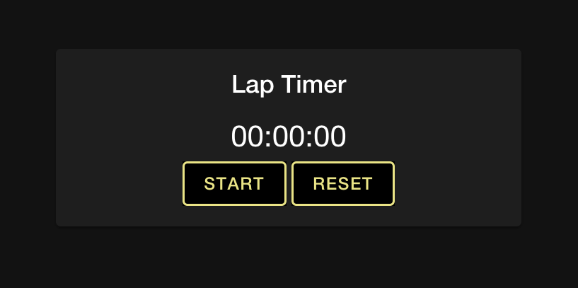
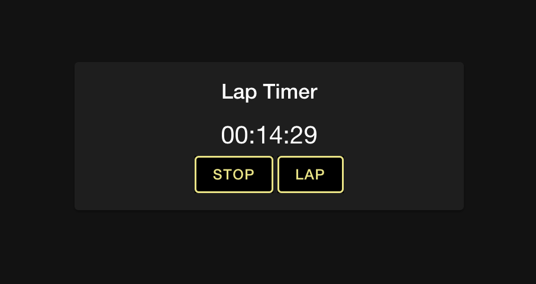
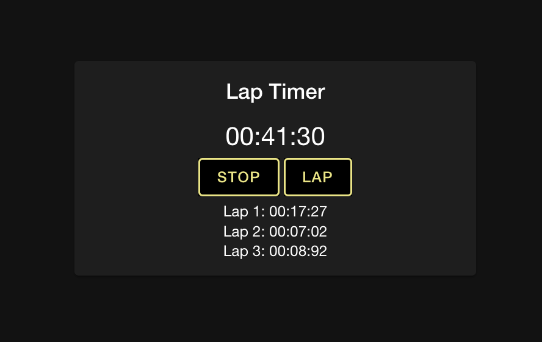

# _Lap Timer_

#### _A stop watch application built using React and Ionic Framework_

#### By _Ryan Walker_

## Description
This application will allow the user to measure time intervals down to 1/100th of a second using button clicks. A user will even be able to compare previous laps against each other. 

## Components

## Setup and Use

### Prerequisites
* A text editor like [VS Code](https://code.visualstudio.com/)
* A command line interface like Terminal or GitBash to run and interact with the app.

### Installation
1. Clone the repository: `$ git clone https://github.com/RyanDanielWalker/Lap_Timer`
2. Navigate to the `/Lap_Timer` directory on your computer
3. Open with your preferred text editor to view the code base
4. To install dependencies, run the command `npm install`
4. To run the app:
    * Run the command `npm start` to run the project!
    * View the application via your preferred web browser by visiting `localhost:3000/`

## Known Bugs
There were no bugs detected.

## Technologies Used
* JavaScript
* React
* Ionic Framework
* CSS
* Git
* GitHub

### License

MIT

Copyright (c) 2021 _Ryan Walker_

## Contact Information
[Ryandanielwalker@gmail.com](mailto:ryandanielwalker@gmail.com)
